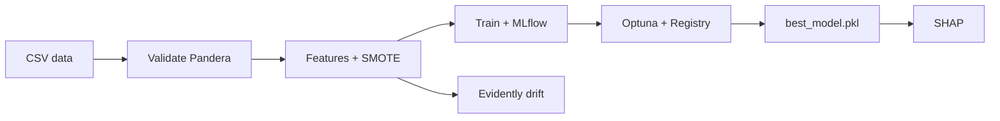
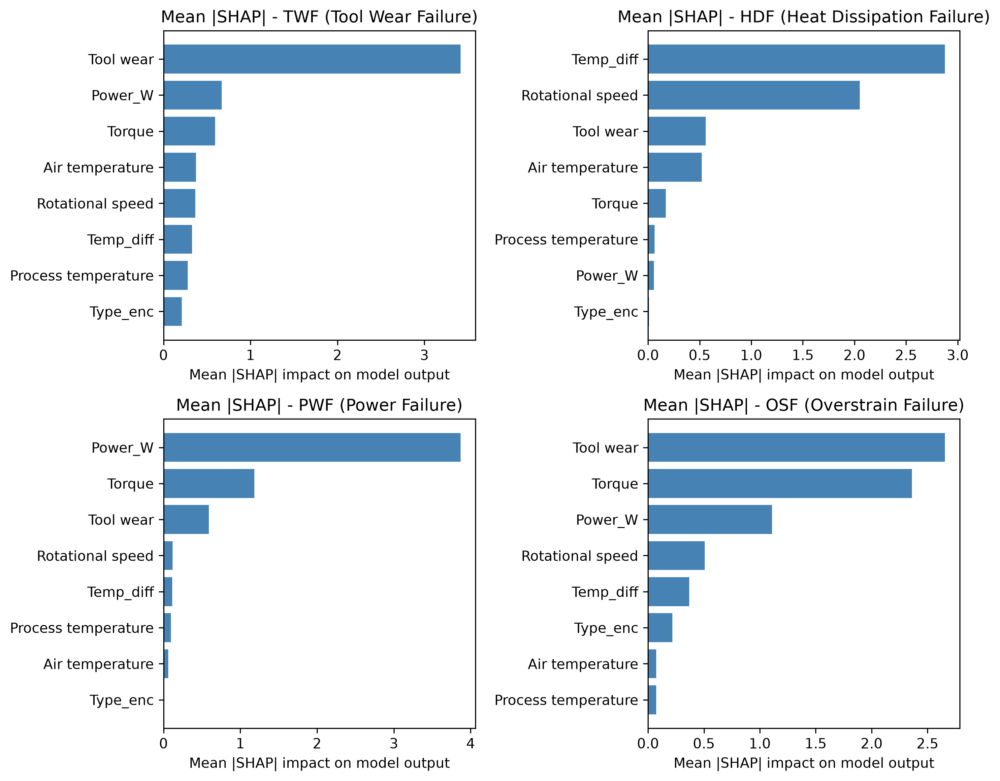

# End-to-End MLOps Pipeline

[](https://www.python.org/)
[](https://scikit-learn.org/)
[](https://mlflow.org/)
[](https://optuna.org/)
[](https://www.evidentlyai.com/)
[](https://shap.readthedocs.io/)

**Industrial predictive maintenance** — multi-class failure-type classification with a production-style MLOps workflow: data contracts, training, experiment tracking, hyperparameter tuning, drift monitoring, and explainability.

**Repository:** [github.com/hargovindk04-tech/mlops-end-to-end-pipeline](https://github.com/hargovindk04-tech/mlops-end-to-end-pipeline)

---

## Problem

Shop-floor machines stream sensor readings (temperature, speed, torque, tool wear). When a machine fails, downtime is costly. The goal is to:

1. **Validate** incoming batches before they enter the pipeline  
2. **Train and track** classifiers for failure types (TWF, HDF, PWF, OSF)  
3. **Tune and register** a deployable model  
4. **Monitor** distribution shift between historical, current, and stress batches  
5. **Explain** which features drive each failure class  

This repo refactors a monolithic Jupyter notebook into a **modular, CLI-driven pipeline**.

---

## Architecture



Detailed design: [docs/ARCHITECTURE.md](docs/ARCHITECTURE.md)

---

## Tech stack

| Area | Tools |
|------|--------|
| Data quality | Pandera |
| ML | scikit-learn, XGBoost, LightGBM |
| Imbalance | imbalanced-learn (SMOTE) |
| Experiments | MLflow (SQLite backend, Model Registry) |
| HPO | Optuna (TPE, 30 trials) |
| Monitoring | Evidently AI |
| Explainability | SHAP (TreeExplainer) |
| Packaging | setuptools, `mlops-pipeline` CLI |

---

## MLOps capabilities

- [x] Centralized config and paths  
- [x] Pandera schema validation (strict + lazy stress checks)  
- [x] Feature engineering (`Power_W`, `Temp_diff`)  
- [x] Stratified split + SMOTE on train only  
- [x] Four-model comparison with macro F1  
- [x] MLflow metrics and model artifacts  
- [x] Optuna tuning + `PredMaint_XGBoost` → `production` alias  
- [x] Evidently HTML drift reports  
- [x] SHAP per failure class  
- [x] Single-command CLI with stage flags  

---

## Sample results

*From a full local run (your numbers may vary slightly).*

| Step | Metric / outcome |
|------|------------------|
| Model selection (best) | **XGBoost** — macro F1 ≈ **0.75** |
| After Optuna | macro F1 ≈ **0.76** (+~0.008 vs baseline XGB) |
| Current batch drift | No dataset drift (0/5 sensor features) |
| Stress batch drift | Drift on **Rotational speed**, **Torque**, **Tool wear** |
| SHAP (examples) | TWF → Tool wear; HDF → Temp_diff; PWF → Power_W; OSF → Tool wear |

### Explainability preview



*After running the pipeline, open `reports/drift_current.html` and `reports/drift_stress.html` in a browser for interactive drift dashboards.*

---

## Project structure

```
mlops-end-to-end-pipeline/
├── config/                 # paths.py, config.py
├── data/raw/               # train, current, stress, raw CSVs
├── docs/
│   ├── ARCHITECTURE.md
│   └── images/             # README screenshots
├── models/                 # best_model.pkl (generated, gitignored)
├── reports/                # Evidently + SHAP outputs (generated)
├── notebooks/              # Original MLOps.ipynb
├── src/
│   ├── pipeline.py         # CLI orchestration
│   ├── data_loader.py
│   ├── schema_validation.py
│   ├── feature_engineering.py
│   ├── preprocessing.py
│   ├── train.py
│   ├── evaluation.py
│   ├── mlflow_tracking.py
│   ├── optuna_tuning.py
│   ├── drift_detection.py
│   └── shap_analysis.py
├── requirements.txt
└── setup.py
```

---

## Quick start

### 1. Clone and install

```bash
git clone https://github.com/hargovindk04-tech/mlops-end-to-end-pipeline.git
cd mlops-end-to-end-pipeline

python -m venv .venv
# Windows PowerShell:
.\.venv\Scripts\Activate.ps1

pip install -r requirements.txt
pip install -e .
```

### 2. Run the full pipeline

```bash
mlops-pipeline
```

Equivalent:

```bash
python -m src
```

**Runtime:** ~3–5 minutes on a typical laptop (includes 30 Optuna trials).

### 3. Run by stage

| Command | Use case |
|---------|----------|
| `mlops-pipeline --stage data` | Validate data and preprocessing only |
| `mlops-pipeline --stage train` | Train + Optuna + save model |
| `mlops-pipeline --stage monitor` | Drift reports only |
| `mlops-pipeline --stage explain` | SHAP (needs `models/best_model.pkl`) |
| `mlops-pipeline --no-optuna` | Faster train; skip HPO |
| `mlops-pipeline --no-mlflow` | Train without MLflow logging |

### 4. MLflow UI

Use the absolute path to your `mlflow.db` (forward slashes on Windows):

```bash
mlflow ui --backend-store-uri sqlite:///D:/path/to/mlops-end-to-end-pipeline/mlflow.db
```

Experiments: **`PredMaint_ModelSelection`**, **`PredMaint_Optuna`**.

---

## Outputs

| Artifact | Path |
|----------|------|
| Production model | `models/best_model.pkl` |
| MLflow DB | `mlflow.db` |
| Current drift | `reports/drift_current.html` |
| Stress drift | `reports/drift_stress.html` |
| SHAP figure | `reports/shap_per_class.png` |

---

## For recruiters / interviewers

**Elevator pitch:** *I converted an end-to-end MLOps assignment into a modular Python project with a CLI. Data is gated by Pandera; training is logged in MLflow; XGBoost is tuned with Optuna and registered with a production alias; Evidently flags batch drift; SHAP explains drivers per failure class.*

**Suggested demo order (5 min):**

1. `mlops-pipeline --help`  
2. `mlops-pipeline --stage data` (fast)  
3. Show `reports/drift_stress.html` (stress vs train)  
4. Show `docs/images/shap_per_class.png`  
5. MLflow UI — model selection runs and registry  

---

## Origin

Built from the **Predictive Maintenance** MLOps notebook (`notebooks/MLOps.ipynb`), split into sessions: repo setup → validation → features → training → MLflow/Optuna → monitoring/SHAP → CLI polish.

---

## License

This project is for portfolio and educational use. Add a license file before commercial use.
