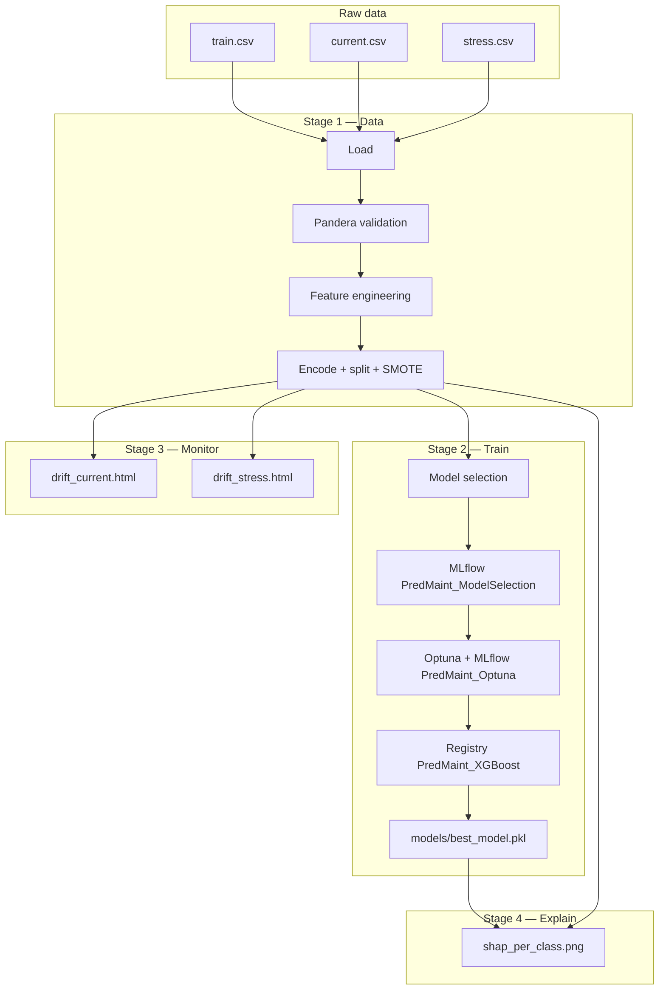

# Architecture

## Pipeline stages

The orchestrator (`src/pipeline.py`) runs four logical stages. Each stage is implemented in dedicated modules so notebooks logic stays testable and reusable.

| Stage | Module(s) | Responsibility |
|-------|-----------|----------------|
| 1. Data | `data_loader`, `schema_validation`, `feature_engineering`, `preprocessing` | Load CSVs, Pandera contracts, derived features, encoding, stratified split, SMOTE |
| 2. Train | `train`, `evaluation`, `mlflow_tracking`, `optuna_tuning` | Four-model benchmark, MLflow logging, Optuna XGBoost tuning, model registry |
| 3. Monitor | `drift_detection` | Evidently reports: train vs current, train vs stress |
| 4. Explain | `shap_analysis` | Per-class SHAP drivers for failure types TWF–OSF |

## Data flow

## Configuration

- **`config/paths.py`** — project root, data paths, artifact paths (`BEST_MODEL_PATH`, reports, MLflow SQLite).
- **`config/config.py`** — hyperparameters, feature lists, class names, experiment names.

## Design choices (interview talking points)

1. **Schema validation before training** — Pandera enforces sensor ranges; valid data can still drift (Evidently).
2. **SMOTE only on training split** — avoids synthetic leakage into validation.
3. **Separate model selection vs tuning experiments** — `PredMaint_ModelSelection` vs `PredMaint_Optuna`.
4. **Production alias** — tuned XGBoost registered as `PredMaint_XGBoost` with `production` alias in MLflow Model Registry.
5. **CLI stages** — `mlops-pipeline --stage …` for faster iteration without retraining.
